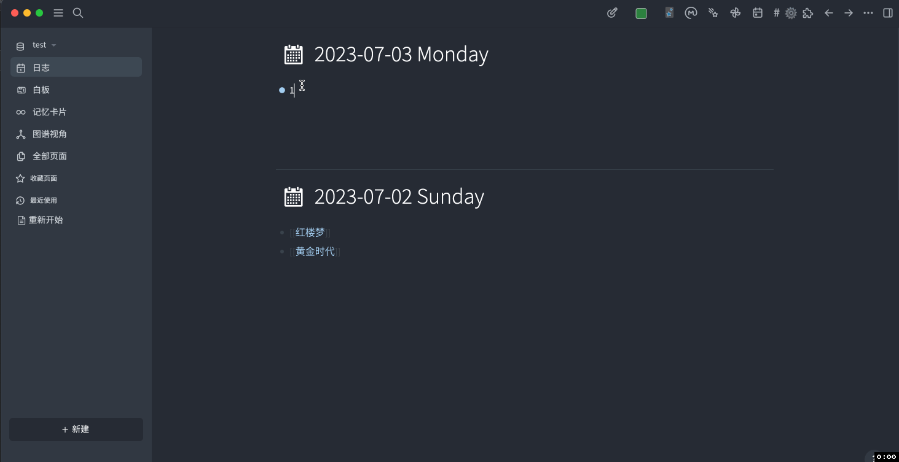
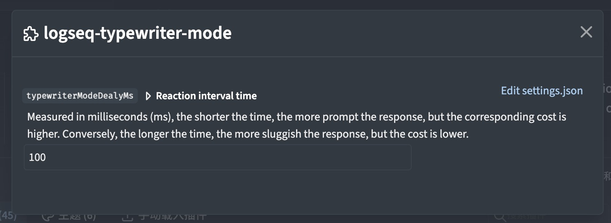

- # loseq-typewriter-mode
	- loseq typewriter mode plugin
- ## Demo
	- 
- ## Setting
	- Reaction interval time
		- Measured in milliseconds (ms), the shorter the time, the more prompt the response, but the corresponding cost is higher. Conversely, the longer the time, the more sluggish the response, but the cost is lower.
		- 
- ## 许可证
	- [MIT](https://choosealicense.com/licenses/mit/)
